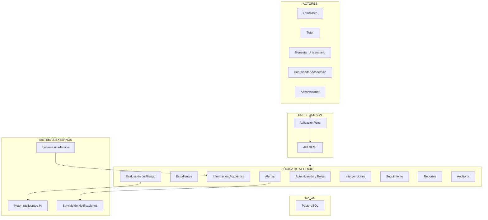

# Arquitectura inicial del sistema

## Diagrama de arquitectura

## Descripción

La arquitectura inicial se organiza en tres capas principales:

- **Presentación:** permite la interacción de estudiantes, tutores, responsables de bienestar, coordinadores y administradores mediante una aplicación web conectada a una API REST.

- **Lógica de negocio:** contiene los módulos responsables de autenticación, gestión de estudiantes, información académica, evaluación del riesgo, alertas, intervenciones, seguimiento, reportes y auditoría.

- **Datos:** almacena la información académica, evaluaciones de riesgo, intervenciones y demás información persistente utilizando PostgreSQL.

El sistema también contempla integración con un sistema académico como fuente de información, un motor inteligente encargado del análisis del riesgo y un servicio de notificaciones para la distribución de alertas.