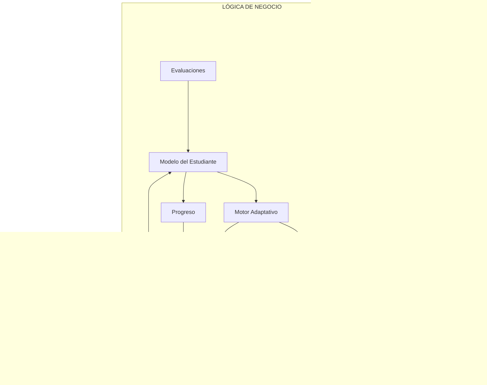

# Arquitectura inicial del sistema

## Diagrama de arquitectura

```mermaid
flowchart TD

%% =========================
%% ACTORES
%% =========================
subgraph ACTORES["ACTORES"]
    Estudiante["Estudiante"]
    Docente["Docente"]
    Admin["Administrador"]
end

%% =========================
%% EDGE
%% =========================
Cloudflare["Cloudflare<br/>DNS / CDN / Protección"]

%% =========================
%% PRESENTACIÓN
%% =========================
subgraph PRESENTACION["PRESENTACIÓN"]
    Web["Aplicación Web"]
    API["API REST"]
end

%% =========================
%% LÓGICA DE NEGOCIO
%% =========================
subgraph NEGOCIO["LÓGICA DE NEGOCIO"]
    Usuarios["Usuarios"]
    Evaluaciones["Evaluaciones"]
    Perfil["Modelo del Estudiante"]
    Adaptativo["Motor Adaptativo"]
    Contenidos["Contenidos"]
    Ejercicios["Ejercicios"]
    Feedback["Retroalimentación"]
    Progreso["Progreso"]
    Analitica["Analítica Docente"]
end

%% =========================
%% DATOS
%% =========================
subgraph DATOS["DATOS"]
    BD["PostgreSQL"]
end

%% =========================
%% EXTERNOS
%% =========================
subgraph EXTERNOS["SISTEMAS EXTERNOS"]
    Notifications["Servicio de Notificaciones"]
end

%% =========================
%% FLUJO
%% =========================

ACTORES --> Cloudflare
Cloudflare --> Web
Web --> API
API --> NEGOCIO
NEGOCIO --> BD

Evaluaciones --> Perfil
Perfil --> Adaptativo
Adaptativo --> Contenidos
Adaptativo --> Ejercicios
Ejercicios --> Feedback
Feedback --> Perfil
Perfil --> Progreso

Progreso --> Notifications
```

## Descripción

La arquitectura inicial se organiza en tres capas principales.

- **Presentación:** permite la interacción de estudiantes, docentes y
administradores mediante una aplicación web conectada a una API REST.

- **Lógica de negocio:** contiene los módulos de usuarios, evaluaciones,
modelo del estudiante, motor adaptativo, contenidos, ejercicios,
retroalimentación, progreso y analítica docente.

- **Datos:** almacena la información de usuarios, contenidos, respuestas,
niveles de dominio, progreso y demás información persistente mediante
PostgreSQL.

Cloudflare funciona como capa de entrada de la solución, proporcionando
servicios de distribución y protección del tráfico antes de que las solicitudes
alcancen la aplicación.

El servicio de notificaciones constituye una integración externa utilizada
para entregar avisos relacionados con actividades y progreso.