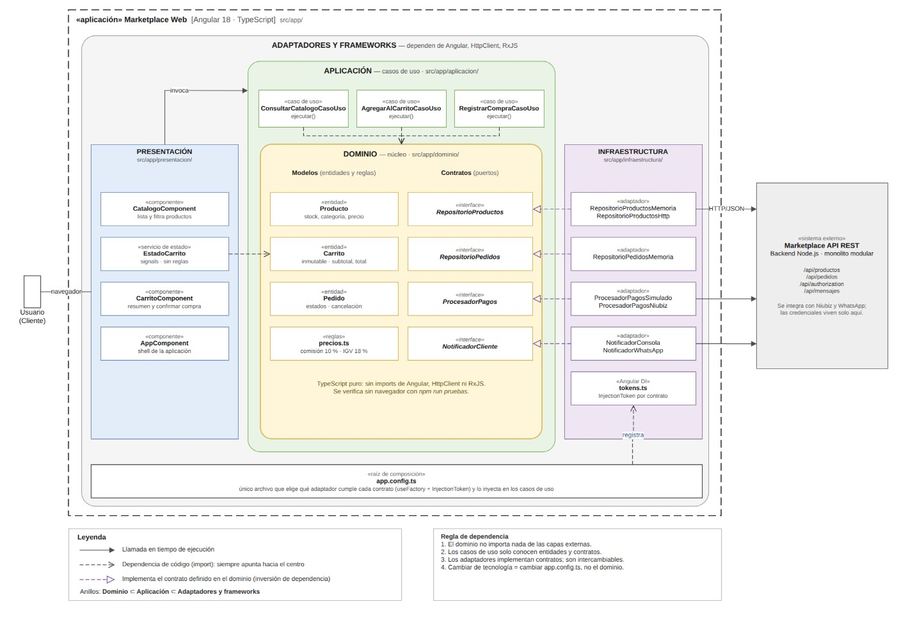

## Descripción

El Marketplace adopta un estilo arquitectónico de **Monolito Modular**, en el cual todas las funcionalidades del sistema se despliegan como una sola aplicación, pero internamente se encuentran organizadas en módulos con responsabilidades claramente definidas.

Los principales módulos del sistema son **Usuarios, Sellers, Catálogo, Carrito, Pedidos y Pagos**. Cada uno se encarga de una parte específica del negocio, lo que permite mantener una mejor separación de responsabilidades y reducir el acoplamiento entre las funcionalidades.

Este estilo arquitectónico permite mantener una estructura relativamente simple de despliegue, al trabajar con una sola aplicación, y al mismo tiempo facilita el mantenimiento y la evolución del sistema gracias a la organización modular.

Además, el sistema se comunica con servicios externos como la **pasarela de pago, el servicio de envío y el ERP**, utilizando mecanismos de integración definidos para evitar que estas dependencias afecten directamente a los módulos internos del negocio.

La elección de este estilo responde principalmente a los drivers arquitectónicos relacionados con la **escalabilidad, el rendimiento y la mantenibilidad**, permitiendo que el sistema pueda crecer y modificarse sin afectar innecesariamente otros módulos.

## Diagrama del enfoque arquitectónico

