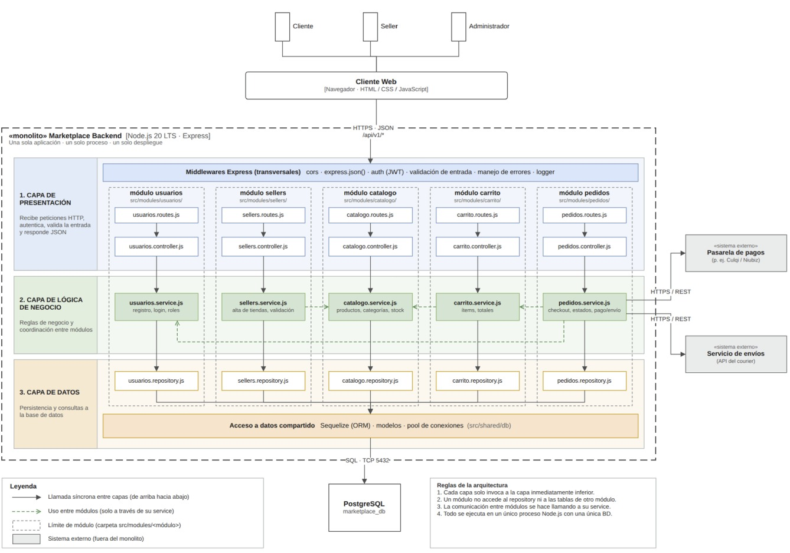

# Estilo Arquitectónico

## Marketplace de productos para mascotas

El sistema utilizará un estilo arquitectónico de monolito modular, organizando las funcionalidades principales en módulos independientes dentro de una misma aplicación desplegable.

## Diagrama de arquitectura

